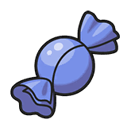

<!-- Header -->

    
    <h1>Candypilled</h1>
    <h4>
        <a href="https://github.com/czhangy/candypilled/issues">New Issue</a>
    </h4>

 

## Tech Stack

<!-- Shields.io Badges: https://github.com/Ileriayo/markdown-badges -->

## External Resources

- [Vercel](https://vercel.com/)
